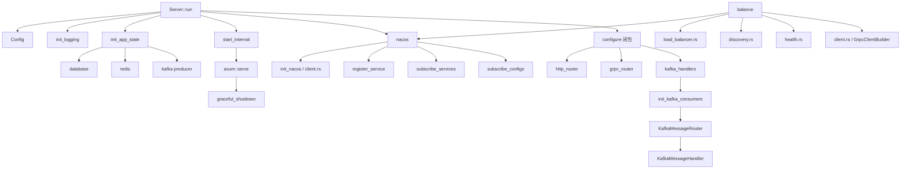

# fbc-starter 架构分析与优化建议

> **仓库**: [github.com/fangbc5/fbc-starter](https://github.com/fangbc5/fbc-starter)
> **版本**: 0.1.8 | **语言**: Rust (edition 2021)
> **定位**: 基于 Axum 的生产级 Web 服务器 Starter —— 开箱即用的微服务脚手架

---

## 1. 总体架构

```
┌─────────────────────────────────────────────────────────────┐
│                     Server::run(|builder| { ... })          │
│                     (Builder Pattern 入口)                   │
├─────────────┬───────────────┬───────────────────────────────┤
│   Config    │   AppState    │   ServerBuilder                │
│  (环境变量)  │  (依赖容器)   │  (路由注册 + Kafka Handlers)   │
├─────────────┴───────────────┴───────────────────────────────┤
│                        核心模块                              │
│  ┌─────────┐ ┌──────────┐ ┌───────┐ ┌─────────┐            │
│  │  http   │ │ logging  │ │ error │ │ entity  │            │
│  │(CORS/   │ │(日志系统) │ │(统一   │ │(基础实体 │            │
│  │ Trace)  │ │          │ │ 错误)  │ │ Trait)  │            │
│  └─────────┘ └──────────┘ └───────┘ └─────────┘            │
├─────────────────────────────────────────────────────────────┤
│                   可选模块 (Feature Gate)                    │
│  ┌──────────┐ ┌───────┐ ┌─────────┐ ┌────────┐ ┌────────┐ │
│  │ database │ │ redis │ │  nacos  │ │ kafka  │ │balance │ │
│  │(MySQL/   │ │(连接池)│ │(注册/   │ │(生产/  │ │(gRPC + │ │
│  │ PG/SQLite│ │       │ │ 发现/   │ │ 消费)  │ │ LB)   │ │
│  │)        │ │       │ │ 配置)   │ │        │ │       │ │
│  └──────────┘ └───────┘ └─────────┘ └────────┘ └────────┘ │
└─────────────────────────────────────────────────────────────┘
```

## 2. Feature Flags 设计

| Feature | 依赖 | 说明 |
|---------|------|------|
| `mysql` | sqlx (mysql) | MySQL 数据库支持 |
| `postgres` | sqlx (postgres) | PostgreSQL 数据库支持 |
| `sqlite` | sqlx (sqlite) | SQLite 数据库支持 |
| `redis` | redis, deadpool-redis | Redis 连接池 |
| `local_cache` | moka | 本地内存缓存（类 Caffeine） |
| `nacos` | nacos_rust_client 0.3 | Nacos 服务注册/发现/配置管理 |
| `balance` | nacos + tonic + tower-load + reqwest | gRPC 客户端 + 负载均衡 |
| `grpc` | tonic + http-body-util | gRPC 服务端 (axum 集成) |
| `kafka` | rdkafka | Kafka 消息队列基础支持 |
| `producer` | kafka | Kafka 生产者 |
| `consumer` | kafka | Kafka 消费者 + 消息路由 |

## 3. 核心模块分析

### 3.1 启动流程 (`server.rs`)

使用 **Builder Pattern** 的闭包配置方式：

```rust
Server::run(|builder| {
    let config = builder.config();
    let state = builder.app_state();
    builder
        .http_router(my_routes)
        .grpc_router(my_grpc)         // 可选
        .with_kafka_handler(handler)   // 可选
}).await?;
```

**启动顺序**:

```
 1. Config::from_env()           — 加载配置（.env + 环境变量）
 2. init_logging()               — 初始化日志系统
 3. nacos::init_nacos()          — [可选] 初始化 Nacos 客户端
 4. nacos::register_service()    — [可选] 注册服务到 Nacos
 5. nacos::subscribe_services()  — [可选] 订阅服务发现
 6. nacos::subscribe_configs()   — [可选] 订阅配置变更
 7. init_app_state()             — 初始化 DB/Redis/Kafka Producer
 8. configure(builder)           — 用户闭包（注册路由和 Kafka handlers）
 9. init_kafka_consumers()       — [可选] 初始化 Kafka 消费者组
10. start_internal()             — 启动 HTTP 服务器 + 优雅关闭
```

### 3.2 配置管理 (`config.rs`)

基于 `config` crate + `dotenvy`，支持多来源配置合并：

| 配置块 | 结构体 | 关键字段 |
|--------|--------|----------|
| 服务器 | `ServerConfig` | `addr`, `port`, `workers`, `context_path` |
| 日志 | `LogConfig` | `level`, `json`, `timezone`, `file` (可选) |
| CORS | `CorsConfig` | `allowed_origins`, `allowed_methods`, `allow_credentials` |
| 数据库 | `DatabaseConfig` | `url`, `max_connections`, `min_connections` |
| Redis | `RedisConfig` | `url`, `password`, `pool_size` |
| Nacos | `NacosConfig` | `server_addrs`, `namespace`, `service_name`, `subscribe_services`, `subscribe_configs` |
| Kafka | `KafkaConfig` | `brokers`, `producer`, `consumer` |

**环境变量前缀**: `APP__`，双下划线分隔层级 (如 `APP__NACOS__SERVER_ADDRS`)。

### 3.3 应用状态 (`state.rs`)

`AppState` 是**中央依赖容器**，使用 Builder 模式按需注入：

```rust
AppState {
    start_time: DateTime<Local>,
    mysql: Option<Arc<MySqlPool>>,       // feature: mysql
    postgres: Option<Arc<PgPool>>,       // feature: postgres
    sqlite: Option<Arc<SqlitePool>>,     // feature: sqlite
    redis: Option<Pool>,                 // feature: redis
    message_producer: Option<...>,       // feature: producer
    message_consumer: Option<...>,       // feature: consumer
}
```

### 3.4 Nacos 集成 (`nacos/`)

```
nacos/
├── mod.rs       — 全局存储 (DashMap) + 公共 API
├── client.rs    — Nacos 客户端初始化 (OnceCell 全局单例)
└── service.rs   — 服务注册/注销/订阅 + 配置订阅
```

| 组件 | 实现 | 说明 |
|------|------|------|
| 客户端存储 | `OnceCell<Arc<NamingClient>>` | 全局单例，初始化一次 |
| 服务实例缓存 | `Lazy<DashMap<String, Vec<Arc<Instance>>>>` | 按服务名缓存实例列表 |
| 配置缓存 | `Lazy<DashMap<String, String>>` | 按 `data_id:group:namespace` 缓存 |
| 实例监听 | `InstanceListener` trait | 变更时更新 DashMap |
| 配置监听 | `ConfigListener` trait | 变更时更新 DashMap |

### 3.5 负载均衡 (`balance/`)

```
balance/
├── client.rs        — gRPC Channel/Client 构建器
├── discovery.rs     — 从 Nacos 获取服务端点
├── health.rs        — 健康检查（已实现但未导出）
└── load_balancer.rs — 轮询负载均衡器 (AtomicUsize + DashMap 全局池)
```

### 3.6 Kafka 消息 (`messaging/`)

```
messaging/
├── mod.rs     — Message/Producer/Consumer trait 定义
├── kafka.rs   — rdkafka 生产者/消费者实现
└── router.rs  — 消息路由（KafkaMessageHandler + KafkaMessageRouter）
```

### 3.7 错误处理 (`error.rs`)

`AppError` 枚举 + `thiserror`，每个 variant 对应不同 HTTP 状态码。
`BizError`、`CommonError`、`CustomerError` 返回 `StatusCode::OK`（业务层错误不用 HTTP 错误码）。

### 3.8 统一响应 (`base.rs`)

`R<T>` 统一响应结构 + `CursorPageBaseResp<T>` 游标分页。

---

## 4. 设计亮点 ✅

### 4.1 Feature Gate 零开销设计

```rust
#[cfg(feature = "nacos")]
pub mod nacos;

#[cfg(feature = "redis")]
pub redis: Option<Pool>,
```

**亮点**: 不启用的功能完全不参与编译，零运行时开销。所有可选模块（DB/Redis/Nacos/Kafka/gRPC）都通过 `#[cfg(feature)]` 条件编译，用户只引入需要的依赖。这在 Rust 生态中是非常标准且优雅的做法。

### 4.2 Builder Pattern 闭包式 API

```rust
Server::run(|builder| {
    builder.http_router(routes).grpc_router(grpc)
}).await?;
```

**亮点**: 闭包式 API 在保持灵活性的同时，避免了框架内部状态泄露。用户在闭包中可以访问 `config()` 和 `app_state()`，又无法绕过框架的初始化流程。

### 4.3 gRPC 与 HTTP 共端口

```rust
// server.rs: add_grpc_services()
router.fallback_service(grpc_adapter)
```

**亮点**: 通过 axum 的 `fallback_service` 将 gRPC 服务托管在同一个端口，HTTP 路由优先匹配，未匹配的请求由 gRPC 处理。无需额外端口，部署简化。

### 4.4 Nacos 全局 DashMap 缓存

```rust
static SERVICE_INSTANCES: Lazy<DashMap<String, Vec<Arc<Instance>>>> = ...;
static NACOS_CONFIGS: Lazy<DashMap<String, String>> = ...;
```

**亮点**: 使用 `DashMap` 提供高并发无锁读写，任何模块都可以通过 `get_service_instances()` 获取最新实例列表，不需要传递状态引用。

### 4.5 Kafka 消息路由器

```rust
trait KafkaMessageHandler: Send + Sync {
    fn topic(&self) -> &str;
    fn group_id(&self) -> &str;
    async fn handle(&self, message: Message);
}
```

**亮点**: 用户只需实现 `KafkaMessageHandler` trait 并注册到 builder，框架自动按 `group_id` 分组创建消费者、按 `topic` 路由消息。解耦了消息消费基础设施和业务逻辑。

### 4.6 上下文路径嵌套

```rust
if let Some(ref context_path) = self.config.server.context_path {
    Router::new().nest(path.as_ref(), router)
}
```

**亮点**: 支持可配置的 `context_path`（如 `/api`），所有路由自动嵌套到该路径下，适应不同部署场景（反向代理等）。

### 4.7 日志时区可配置

**亮点**: 支持通过 `log.timezone` 配置日志时区偏移，默认东八区。在国际化部署场景下非常实用。

---

## 5. 待优化项 ⚠️

### 5.1 `init_logging` 代码重复 — **高优先级**

**问题**: `lib.rs` 中 `init_logging` 函数长达 200 行，包含 4 个分支 `(json × file_format)` 的组合，每个分支几乎是复制粘贴，仅 `.json()` 调用不同。

**影响**: 维护一个分支改了，其他三个容易遗漏。

**建议**: 用宏或抽取层构建函数消除重复：

```rust
fn create_stdout_layer(json: bool, timer: &OffsetTime) -> Box<dyn Layer<S>> {
    if json {
        Box::new(fmt::layer().json().with_timer(timer.clone()))
    } else {
        Box::new(fmt::layer().with_timer(timer.clone()))
    }
}
```

### 5.2 `AppState` 缺少用户扩展能力 — **高优先级**

**问题**: `AppState` 的字段是固定的（DB/Redis/Kafka），用户无法添加自己的业务状态。实际项目中（如 hula-server 的 ms-websocket）都需要自定义一个新的 `AppState` 包裹 `fbc_starter::AppState`。

**建议**: 在 `AppState` 中增加泛型扩展槽或 `extensions` 字段：

```rust
pub struct AppState<T = ()> {
    // ... 原有字段
    pub extensions: T,
}
```

或使用 `type_map` / `AnyMap` 方式：

```rust
pub struct AppState {
    // ... 原有字段
    extensions: dashmap::DashMap<std::any::TypeId, Box<dyn std::any::Any + Send + Sync>>,
}
```

### 5.3 `health.rs` 每次检查都创建 HTTP 客户端 — **中优先级**

**问题**: `check_instance_health()` 在每次健康检查时都调用 `reqwest::Client::builder().build()`，创建新的 HTTP 客户端（含连接池），未复用。

```rust
async fn check_instance_health(url: &str, timeout_secs: u64) -> bool {
    let client = reqwest::Client::builder()
        .timeout(Duration::from_secs(timeout_secs))
        .build();  // 每次调用都创建新客户端!
```

**建议**: 在 `start_health_check()` 中创建一次 client 并传入闭包复用。

### 5.4 错误类型语义重叠 — **中优先级**

**问题**: `AppError` 有三个语义几乎相同的变体：

```rust
BizError(i32, String),       // 业务错误
CommonError(i32, String),    // 通用错误
CustomerError(i32, String),  // 自定义错误
```

三者返回 `StatusCode::OK`，结构和处理方式完全一致，对使用者来说区别不清晰。

**建议**: 合并为一个带类别的变体：

```rust
AppError(i32, String, ErrorCategory),

enum ErrorCategory { Biz, Common, Custom }
```

### 5.5 Nacos 命名空间不分离 — **中优先级**

**问题**: `NacosConfig` 只有一个 `namespace` 字段，配置中心和服务注册共享同一命名空间。在生产环境中，配置管理和服务发现通常需要使用不同的命名空间进行隔离。

```rust
pub struct NacosConfig {
    pub namespace: Option<String>,  // 配置和命名共用
    // ...
}
```

**建议**: 分离为 `config_namespace` 和 `naming_namespace`：

```rust
pub struct NacosConfig {
    pub config_namespace: Option<String>,
    pub naming_namespace: Option<String>,
    pub config_group: String,      // 配置组
    pub naming_group: String,      // 服务注册组
    // ...
}
```

### 5.6 负载均衡策略单一 — **低优先级**

**问题**: `RoundRobinLoadBalancer` 是唯一的负载均衡策略，没有 trait 抽象。需要加权轮询、一致性哈希等策略时需要改框架代码。

**建议**: 提取 `LoadBalancer` trait：

```rust
pub trait LoadBalancer: Send + Sync {
    fn next_endpoint(&self) -> Option<ServiceEndpoint>;
}

pub enum LoadBalancerStrategy {
    RoundRobin,
    WeightedRoundRobin,
    IpHash,
}
```

### 5.7 `R<T>` 响应结构携带太多无用字段 — **低优先级**

**问题**: `R<T>` 中 `path`、`version`、`base_version` 字段总是空字符串，序列化后占空间：

```json
{ "success": true, "code": 0, "data": {...}, "path": "", "version": "", "base_version": "" }
```

**建议**: 要么移除这些字段，要么使用 `#[serde(skip_serializing_if = "String::is_empty")]` 条件跳过，或将其移到中间件层自动填充。

### 5.8 `build_channel` 的错误处理 — **低优先级**

**问题**: `load_balancer.rs` 中当无可用端点时，通过构造无效地址来触发错误：

```rust
let invalid_endpoint = tonic::transport::Endpoint::from_static("http://[::1]:0");
return invalid_endpoint.connect().await;
```

**建议**: 直接返回自定义错误，语义更清晰：

```rust
pub async fn build_channel(&self) -> Result<Channel, AppError> {
    let endpoint = self.next_endpoint()
        .ok_or(AppError::ServiceUnavailable(self.service_name.clone()))?;
    endpoint.endpoint.connect().await.map_err(|e| e.into())
}
```

### 5.9 配置 `from_env` 与 Default 不一致 — **低优先级**

**问题**: `Config::from_env()` 失败时 fallback 到 `Config::default()`，但 `default()` 中 CORS、日志等配置和实际 `.env.example` 不完全匹配，可能导致意外行为。

**建议**: 提供更明确的错误信息，或确保 `Default` 实现和文档中的推荐配置完全一致。

---

## 6. 优化计划

### 阶段一：代码质量（1-2 天）

| 编号 | 优化项 | 优先级 | 估计工时 |
|------|--------|--------|----------|
| O-1 | 重构 `init_logging` 消除 4 路分支重复 | 高 | 2h |
| O-2 | 合并 `BizError`/`CommonError`/`CustomerError` | 中 | 1h |
| O-3 | `R<T>` 空字段跳过序列化 | 低 | 0.5h |
| O-4 | `build_channel` 使用自定义错误替代无效地址 | 低 | 0.5h |

### 阶段二：架构增强（3-5 天）

| 编号 | 优化项 | 优先级 | 估计工时 |
|------|--------|--------|----------|
| O-5 | `AppState` 增加泛型扩展或 Extensions Map | 高 | 4h |
| O-6 | Nacos 配置/命名命名空间分离 | 中 | 2h |
| O-7 | 复用 `reqwest::Client` 做健康检查 | 中 | 1h |
| O-8 | 提取 `LoadBalancer` trait 支持多策略 | 低 | 3h |

### 阶段三：功能增强（可选）

| 编号 | 优化项 | 优先级 | 估计工时 |
|------|--------|--------|----------|
| O-9 | 增加 `local_cache` 的实际 API 封装 | 低 | 2h |
| O-10 | 提供 Nacos 配置热更新回调机制 | 中 | 3h |
| O-11 | 增加优雅关闭时的 Nacos 注销逻辑 | 中 | 1h |
| O-12 | 导出 `health.rs` 并集成到负载均衡 | 低 | 2h |

---

## 7. 模块依赖关系



## 8. 文件清单

| 文件 | 行数 | 职责 |
|------|------|------|
| `lib.rs` | 274 | 模块入口 + `init_logging` |
| `server.rs` | 583 | Server/Builder + 启动流程 |
| `config.rs` | 677 | 全配置结构体 + 默认值 + `from_env` |
| `state.rs` | 181 | AppState 依赖容器 |
| `error.rs` | 251 | AppError + IntoResponse |
| `base.rs` | 159 | R\<T\> 统一响应 + 游标分页 |
| `nacos/mod.rs` | 69 | DashMap 存储 + 公共 API |
| `nacos/client.rs` | 109 | Nacos 客户端初始化 |
| `nacos/service.rs` | 297 | 服务注册/订阅 + 配置订阅 |
| `balance/load_balancer.rs` | 99 | 轮询 LB + 全局池 |
| `balance/discovery.rs` | 45 | Nacos → Endpoint 转换 |
| `balance/health.rs` | 177 | 实例健康检查（未导出） |
| `messaging/kafka.rs` | ~300 | rdkafka 生产/消费实现 |
| `messaging/router.rs` | ~160 | 消息路由器 |
| `http/middleware.rs` | ~100 | CORS + Trace + 请求日志 |
| **合计** | **~3500** | — |
