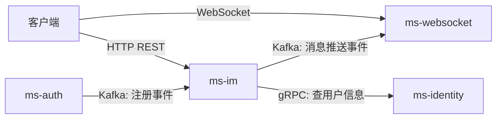

# ms-im 微服务化架构计划

## 背景

HuLa-Server 的 `luohuo-im` 是一个重型单体模块，混合了以下关注点：

| 关注点 | HuLa 位置 | xilulu-server 现有归属 |
|--------|----------|-------------------|
| 用户管理（User, UserState, Role） | luohuo-im | ✅ ms-identity / ms-auth |
| WebSocket / 推送 / 会话管理 | luohuo-ws | ✅ ms-websocket（80+文件） |
| 好友 / 联系人 / 申请 / 黑名单 | luohuo-im | ✅ ms-im 好友模块（Phase 1 已完成） |
| 房间（单聊/群聊）/ 群成员 | luohuo-im | 🔜 ms-im Phase 2 进行中 |
| 消息（发送/撤回/标记/已读） | luohuo-im | ❌ 待 ms-im Phase 3 承接 |
| 通知（公告） | luohuo-im | ⚡ 可复用 ms-notify |
| 朋友圈（Feed） | luohuo-im | 🔜 可后续单独服务 |
| 表情包 / 背包 / 徽章 | luohuo-im | 🔜 非核心，后续扩展 |
| 敏感词过滤 | luohuo-im | 🔜 可作为独立中台能力 |
| 微信集成 / 验证码 / 系统监控 | luohuo-im | ❌ 不属于 IM 范畴 |

## 设计原则

1. **ms-im 只关注 IM 核心领域**：好友关系、会话房间、消息管理
2. **不重复造轮子**：用户信息通过 gRPC 从 ms-identity 获取，推送通过 Kafka → ms-websocket 完成
3. **渐进式迭代**：先核心后扩展，分阶段交付

---

## ms-im 模块划分

```
ms-im/src/
├── main.rs
├── config.rs                    # IM 配置
├── error.rs                     # 统一错误定义
├── router.rs                    # HTTP 路由聚合
│
├── modules/
│   ├── friend/                  # 好友模块
│   │   ├── mod.rs
│   │   ├── entity.rs            # UserFriend, UserApply
│   │   ├── repository.rs
│   │   ├── service.rs           # 申请/同意/删除/黑名单
│   │   └── handler.rs           # HTTP handlers
│   │
│   ├── contact/                 # 会话列表模块
│   │   ├── mod.rs
│   │   ├── entity.rs            # Contact (会话记录)
│   │   ├── repository.rs
│   │   ├── service.rs           # 会话列表/排序/置顶/免打扰
│   │   └── handler.rs
│   │
│   ├── room/                    # 房间模块
│   │   ├── mod.rs
│   │   ├── entity.rs            # Room, RoomFriend, RoomGroup, GroupMember
│   │   ├── repository.rs
│   │   ├── service.rs           # 创建房间/群管理/成员增删
│   │   └── handler.rs
│   │
│   └── message/                 # 消息模块
│       ├── mod.rs
│       ├── entity.rs            # Message, MessageMark
│       ├── repository.rs
│       ├── service.rs           # 发消息/撤回/标记/已读上报
│       └── handler.rs
│
├── kafka/                       # Kafka 消费消息推送事件
│   ├── mod.rs
│   └── handler.rs
│
└── grpc/                        # gRPC (健康检查 + 跨服务调用)
    ├── mod.rs
    └── health.rs
```

## 核心数据表设计（参考 HuLa 精简）

### Phase 1 核心表

```sql
-- 好友关系
CREATE TABLE `user_friend` (
    `id` BIGINT NOT NULL AUTO_INCREMENT,
    `uid` BIGINT NOT NULL COMMENT '用户ID',
    `friend_uid` BIGINT NOT NULL COMMENT '好友ID',
    `remark` VARCHAR(64) DEFAULT NULL COMMENT '好友备注',
    `status` TINYINT DEFAULT 1 COMMENT '1正常 2删除',
    `created_at` DATETIME DEFAULT CURRENT_TIMESTAMP,
    `updated_at` DATETIME DEFAULT CURRENT_TIMESTAMP ON UPDATE CURRENT_TIMESTAMP,
    PRIMARY KEY (`id`),
    UNIQUE KEY `uk_uid_friend` (`uid`, `friend_uid`)
);

-- 好友申请
CREATE TABLE `user_apply` (
    `id` BIGINT NOT NULL AUTO_INCREMENT,
    `uid` BIGINT NOT NULL COMMENT '申请人ID',
    `target_id` BIGINT NOT NULL COMMENT '目标ID',
    `msg` VARCHAR(256) DEFAULT NULL COMMENT '申请消息',
    `type` TINYINT DEFAULT 1 COMMENT '1好友申请 2群申请',
    `status` TINYINT DEFAULT 0 COMMENT '0待审批 1同意 2拒绝',
    `read_status` TINYINT DEFAULT 0 COMMENT '0未读 1已读',
    `created_at` DATETIME DEFAULT CURRENT_TIMESTAMP,
    `updated_at` DATETIME DEFAULT CURRENT_TIMESTAMP ON UPDATE CURRENT_TIMESTAMP,
    PRIMARY KEY (`id`)
);

-- 房间（统一单聊和群聊的抽象层）
CREATE TABLE `room` (
    `id` BIGINT NOT NULL AUTO_INCREMENT,
    `type` TINYINT NOT NULL COMMENT '1单聊 2群聊',
    `hot_flag` TINYINT DEFAULT 0 COMMENT '是否热点群（消息量大的群）',
    `last_msg_id` BIGINT DEFAULT NULL COMMENT '最新消息ID',
    `active_time` DATETIME DEFAULT CURRENT_TIMESTAMP COMMENT '最后活跃时间',
    `created_at` DATETIME DEFAULT CURRENT_TIMESTAMP,
    `updated_at` DATETIME DEFAULT CURRENT_TIMESTAMP ON UPDATE CURRENT_TIMESTAMP,
    PRIMARY KEY (`id`)
);

-- 单聊房间扩展
CREATE TABLE `room_friend` (
    `id` BIGINT NOT NULL AUTO_INCREMENT,
    `room_id` BIGINT NOT NULL,
    `uid1` BIGINT NOT NULL COMMENT '较小的uid',
    `uid2` BIGINT NOT NULL COMMENT '较大的uid',
    `room_key` VARCHAR(64) NOT NULL COMMENT '拼接的roomKey: uid1_uid2',
    `status` TINYINT DEFAULT 1 COMMENT '1正常 2禁用',
    `created_at` DATETIME DEFAULT CURRENT_TIMESTAMP,
    PRIMARY KEY (`id`),
    UNIQUE KEY `uk_room_key` (`room_key`),
    KEY `idx_room_id` (`room_id`)
);

-- 群聊房间扩展
CREATE TABLE `room_group` (
    `id` BIGINT NOT NULL AUTO_INCREMENT,
    `room_id` BIGINT NOT NULL,
    `name` VARCHAR(64) NOT NULL COMMENT '群名',
    `avatar` VARCHAR(256) DEFAULT NULL COMMENT '群头像',
    `notice` TEXT DEFAULT NULL COMMENT '群公告',
    `created_at` DATETIME DEFAULT CURRENT_TIMESTAMP,
    `updated_at` DATETIME DEFAULT CURRENT_TIMESTAMP ON UPDATE CURRENT_TIMESTAMP,
    PRIMARY KEY (`id`),
    KEY `idx_room_id` (`room_id`)
);

-- 群成员
CREATE TABLE `group_member` (
    `id` BIGINT NOT NULL AUTO_INCREMENT,
    `group_id` BIGINT NOT NULL COMMENT 'room_group.id',
    `uid` BIGINT NOT NULL COMMENT '用户ID',
    `role` TINYINT DEFAULT 3 COMMENT '1群主 2管理员 3普通成员',
    `created_at` DATETIME DEFAULT CURRENT_TIMESTAMP,
    `updated_at` DATETIME DEFAULT CURRENT_TIMESTAMP ON UPDATE CURRENT_TIMESTAMP,
    PRIMARY KEY (`id`),
    UNIQUE KEY `uk_group_uid` (`group_id`, `uid`)
);

-- 会话（用户维度的房间视图）
CREATE TABLE `contact` (
    `id` BIGINT NOT NULL AUTO_INCREMENT,
    `uid` BIGINT NOT NULL,
    `room_id` BIGINT NOT NULL,
    `read_time` DATETIME DEFAULT CURRENT_TIMESTAMP COMMENT '已读到的时间',
    `active_time` DATETIME DEFAULT CURRENT_TIMESTAMP,
    `last_msg_id` BIGINT DEFAULT NULL,
    `is_mute` TINYINT DEFAULT 0 COMMENT '是否免打扰',
    `is_top` TINYINT DEFAULT 0 COMMENT '是否置顶',
    `is_deleted` TINYINT DEFAULT 0 COMMENT '是否删除',
    `created_at` DATETIME DEFAULT CURRENT_TIMESTAMP,
    `updated_at` DATETIME DEFAULT CURRENT_TIMESTAMP ON UPDATE CURRENT_TIMESTAMP,
    PRIMARY KEY (`id`),
    UNIQUE KEY `uk_uid_room` (`uid`, `room_id`)
);

-- 消息
CREATE TABLE `message` (
    `id` BIGINT NOT NULL AUTO_INCREMENT,
    `room_id` BIGINT NOT NULL,
    `from_uid` BIGINT NOT NULL COMMENT '发送者',
    `content` TEXT DEFAULT NULL COMMENT '消息内容(JSON)',
    `type` TINYINT NOT NULL COMMENT '消息类型(1文本 2图片 3文件 ...)',
    `reply_msg_id` BIGINT DEFAULT NULL COMMENT '回复的消息ID',
    `status` TINYINT DEFAULT 0 COMMENT '0正常 1撤回',
    `extra` JSON DEFAULT NULL COMMENT '扩展信息',
    `created_at` DATETIME DEFAULT CURRENT_TIMESTAMP,
    `updated_at` DATETIME DEFAULT CURRENT_TIMESTAMP ON UPDATE CURRENT_TIMESTAMP,
    PRIMARY KEY (`id`),
    KEY `idx_room_created` (`room_id`, `created_at`),
    KEY `idx_room_id` (`room_id`)
);

-- 消息标记（点赞/举报等）
CREATE TABLE `message_mark` (
    `id` BIGINT NOT NULL AUTO_INCREMENT,
    `msg_id` BIGINT NOT NULL,
    `uid` BIGINT NOT NULL COMMENT '标记的用户',
    `type` TINYINT NOT NULL COMMENT '1点赞 2举报',
    `status` TINYINT DEFAULT 0 COMMENT '0正常 1取消',
    `created_at` DATETIME DEFAULT CURRENT_TIMESTAMP,
    PRIMARY KEY (`id`),
    UNIQUE KEY `uk_msg_uid_type` (`msg_id`, `uid`, `type`)
);
```

## 分阶段实施计划

### Phase 1 — 基础骨架 + 好友模块 ✅ 已完成

- [x] 清理现有 ms-im scaffold（删除未使用的 HuLa 枚举，保留有用的）
- [x] 搭建 modules 目录结构（friend / contact / room / message）
- [x] 创建 SQL 初始化脚本（8 张表）
- [x] 配置 MySQL（.env）
- [x] 实现 friend 模块：申请、同意、拒绝、删除（单向）、好友列表
- [x] 实现 HTTP handler + 路由注册（6 个端点）

### Phase 2 — 房间 + 会话（🔜 当前阶段）

- [ ] 实现 room 模块：创建单聊房间、创建群聊、成员管理
- [ ] 实现 contact 模块：会话列表、置顶、免打扰、已读时间
- [ ] 好友建立时自动创建单聊 room + contact

### Phase 3 — 消息

- [ ] 实现 message 模块：发送消息、消息列表（游标分页）、撤回
- [ ] 实现 message_mark 模块：点赞/举报
- [ ] 发消息后通过 Kafka → ms-websocket 推送
- [ ] 已读上报（更新 contact.read_time）

### Phase 4 — 扩展能力

- [ ] 敏感词过滤（可独立中台或内嵌）
- [ ] 朋友圈 Feed（可独立模块）
- [ ] 表情包管理
- [ ] gRPC 提供 IM 用户信息查询给其他服务

---

## 跨服务交互



## 与 HuLa-Server 的差异总结

| 方面 | HuLa (luohuo-im) | wula (ms-im) |
|------|------------------|-------------|
| 用户管理 | 内嵌 | ❌ 由 ms-identity 负责 |
| WebSocket | 独立 luohuo-ws | ❌ 由 ms-websocket 负责 |
| 通知推送 | 内嵌 | ❌ 由 ms-notify 负责 |
| 微信集成 | 内嵌 | ❌ 不在 IM 范畴 |
| 系统监控 | 内嵌 Controller | ❌ 不在 IM 范畴 |
| 敏感词 | 内嵌 AC自动机 | 🔜 Phase 4 或独立中台 |
| 核心 IM | 好友/房间/消息 | ✅ ms-im 全部承接 |

## 验证计划

### 编译检查
```bash
cargo check -p ms-im
```

### 手动测试（Phase 1 完成后）
1. 启动 ms-im 服务，确认 MySQL 连接正常
2. 通过 HTTP API 发送好友申请
3. 查看数据库确认 `user_apply` 表有记录
4. 同意申请，确认 `user_friend` 表创建双向记录

> [!IMPORTANT]
> 本计划只列出架构设计和分阶段规划。实际开发中建议逐 Phase 推进，每个 Phase 完成后验证再进入下一阶段。
